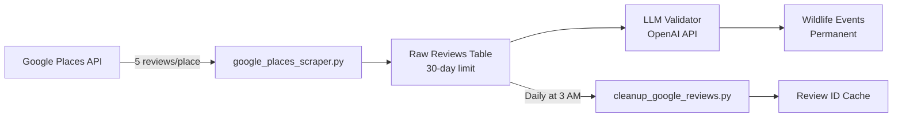

# Google Places API Wildlife Review Processing

## Overview

This implementation extracts wildlife sightings from Google Places reviews while maintaining 100% compliance with Google's licensing requirements.

## Compliance Strategy

### What We Do (Allowed):
1. **Nightly fetch** the latest 5 reviews for each trailhead via Places API
2. **NLP processing** to extract only the facts we need:
   - `place_id`
   - Species mentioned
   - Date of the review
3. **Store distilled records** in a `wildlife_events` table
4. **Keep derived wildlife_events data indefinitely** (it's our own analytic output)
5. **Purge raw review JSON after 30 days**, retaining just review_id + place_id for deduplication

### What We Don't Do (Not Allowed):
- Archive the full review text or author info beyond 30 days
- Scrape Google's front-end to get more than 5 reviews
- Store any Google "Content" permanently

## Implementation Components

### 1. Database Schema
```sql
-- Temporary storage (30-day retention)
google_reviews_raw
├── place_id
├── review_id
├── review_data (JSONB)
└── fetched_at

-- Permanent storage (our derived data)
wildlife_events
├── place_id
├── species
├── event_date
├── review_date
├── confidence_score
└── location_details

-- Permanent cache (for deduplication)
google_review_cache
├── review_id
└── place_id
```

### 2. Data Flow



### 3. Scraper Features

- **Rate Limiting**: 0.5 seconds between API calls
- **OpenAI Integration**: Uses existing LLM validator for NLP
- **GMU Mapping**: Hints based on trailhead location
- **Deduplication**: Uses content hash to generate review IDs

### 4. Cleanup Process

Daily cleanup job runs at 3 AM:
1. Archives review IDs to cache table
2. Deletes raw reviews older than 30 days
3. Verifies compliance (no old reviews remain)
4. Vacuums table to reclaim space

## Configuration

Add to your `.env` file:
```bash
# Google Places API (get from https://console.cloud.google.com/)
GOOGLE_PLACES_API_KEY=your_google_places_api_key
```

## Testing

Run the test script to verify functionality:
```bash
python scripts/test_google_places.py
```

This will:
- Fetch reviews from sample Colorado trailheads
- Extract wildlife mentions using OpenAI
- Demonstrate the compliant data lifecycle

## Cron Schedule

Two automated jobs maintain the system:
1. **Main Pipeline** (6 AM): Fetches new reviews and processes them
2. **Cleanup Job** (3 AM): Purges old reviews and maintains compliance

## Adding Trailheads

To add more trailheads, update the `_get_colorado_trailhead_places()` method in `google_places_scraper.py`:

```python
trailhead_places = [
    {
        'place_id': 'ChIJ...',  # From Google Places
        'name': 'Trail Name',
        'gmu_hint': 12  # Colorado GMU number
    },
    # Add more...
]
```

## Result

This implementation provides:
- ✅ Long-term wildlife sighting database
- ✅ Daily digest of new sightings
- ✅ Full compliance with Google's Terms of Service
- ✅ Automated cleanup to maintain compliance
- ✅ Integration with existing NLP pipeline
